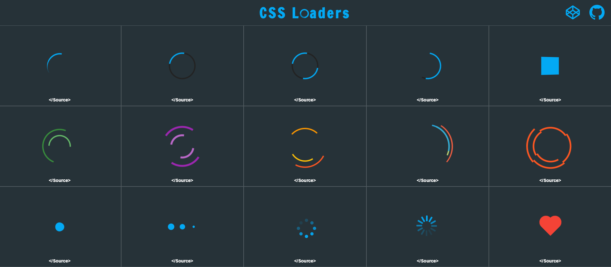

# LoadLab

I'm creating a collection of pure CSS loaders as a side project. Some of these spinners are single elements loaders, while a couple use multiple elements.

Follow these steps to use a loader in your own projects

<ol>
  <li>Copy the HTML and CSS into your project.</li>
   <li>Change the size of your loader by adjusting the height and width. (Must be equal)</li>
   <li>Adjust the border colors to your liking.</li>
   <li>Load away!</li>
</ol>

Visit http://cfoucht.com/loadlab
